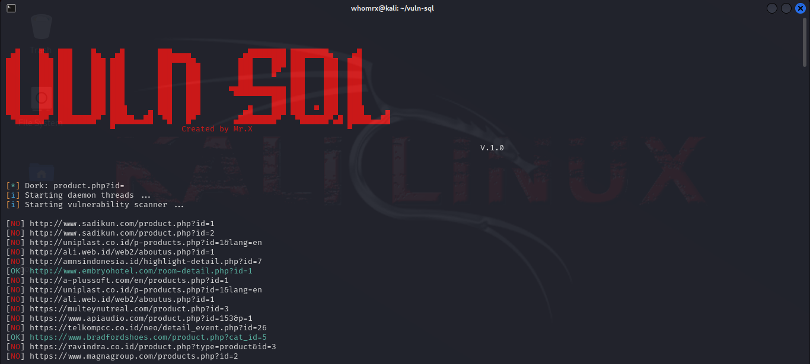

# VULN-SQL

A tool that uses public proxies to find and scan sites for sql injection vulnerability<br>

__Usage:__ `python vuln-sql.py -d product.php?id=`

### Requirements
- Python *v.2.x* **|** *v.3.x*

### Help
```
usage: vuln-sql.py [-h] -d DORK [-w]

optional arguments:
  -h, --help            show this help message and exit
  -d DORK, --dork DORK  dork to search example: product.php?id=
  -w, --write-over      write over the existing log file
```

### How to Install 
```
git clone https://github.com/Whomrx666/vuln-sql.git
cd vuln-sql
pip install -r requirements.txt
python vuln-sql.py -{optional arguments}
```

### Don't write over existing log file 
`python vuln-sql.py -d product.php?id=`

### Writing over existing log file 
`python vuln-sql.py -d product.php?id= -w`

### More dork sql
[Download here](https://www.mediafire.com/file/rfdrbmvqm5wknbv/dork_sql.txt/file)

### Screenshot


### Original Author
<a href="https://github.com/Whomrx666"></a>

Follow me: [Whatsapp](https://wa.me/6287855190571),[Youtube](https://youtube.com/@whomrx666),[Tiktok](https://www.tiktok.com/@whomr.x),[Telegram](https://www.tiktok.com/@whomr.x),[Telegram](https://t.me/@Whomr_X),&[Website](https://whomrxhackers.blogspot.com/)
